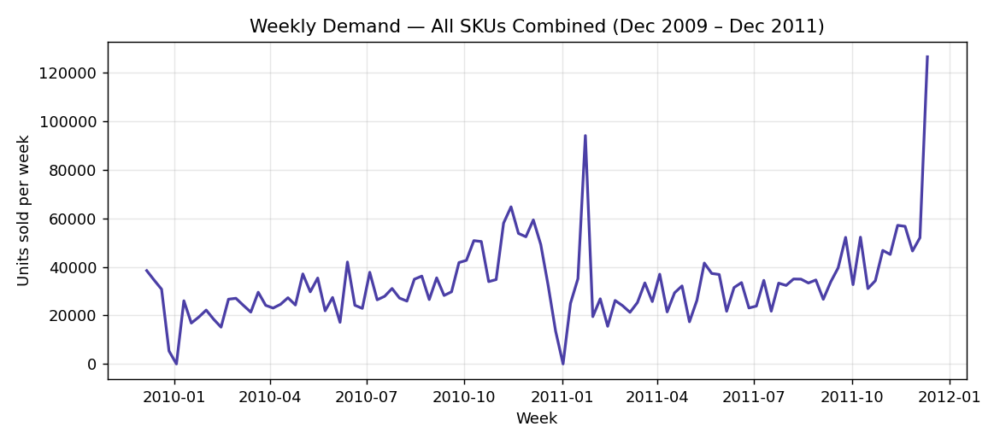
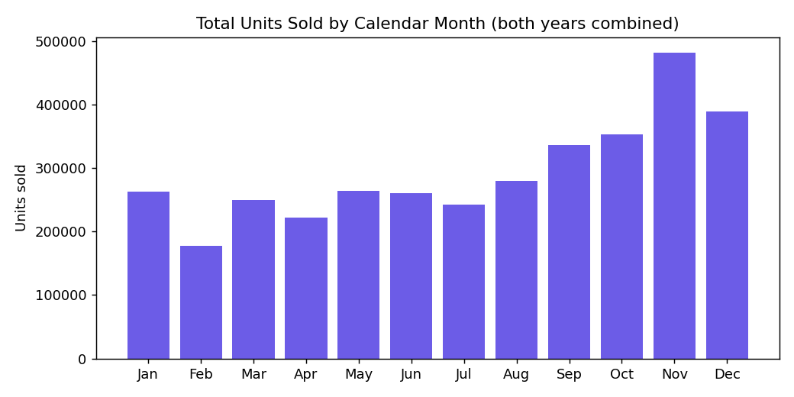
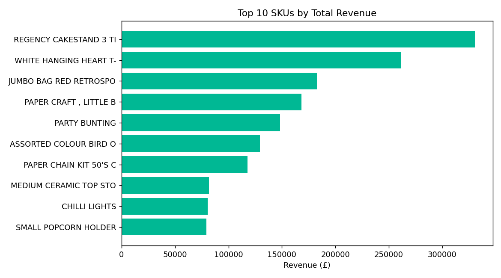
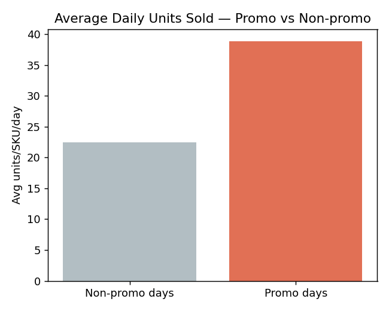

# FORESIGHT — Data-Quality & EDA Insight Memo

**Prepared for:** Head of Operations, NorthBay Living
**Prepared by:** Data Science & Analytics, Zidio Development engagement team
**Covers deliverable:** D2

---

## 1. Data provenance & quality

The analysis uses a real two-year online-retail transaction history (Dec
2009 – Dec 2011) as the sales-history source, cleaned and restructured to
match the four-table schema (`sales_daily`, `sku_master`, `calendar`,
`inventory_snapshots`) specified for this engagement. The catalog was
narrowed to NorthBay's actual scale — the **top 200 SKUs by revenue** —
matching the brief's description of "~200 active SKUs."

**Cleaning steps applied (see `src/pipeline.py` for exact code):**

| Issue found | Rows affected | How handled |
|---|---|---|
| Exact duplicate rows | 34,335 | Dropped |
| Cancelled orders (refunds, Invoice prefix "C") | 19,494 invoices | Excluded — refunds are not demand signal |
| Non-positive quantity or price (stray adjustments) | ~9,000 | Excluded |
| Non-product codes (postage, bank charges, manual entries) | ~15,000 | Excluded via a known-code exclusion list |
| Missing product description | 4,382 | Backfilled from the SKU's most common description; rows with no description anywhere were dropped |

**Total: 1,067,371 raw rows → 1,003,418 cleaned rows → 147,800 SKU-day
records across the selected 200-SKU catalog.**

**One important limitation, stated plainly:** the source data contains no
real inventory records. `inventory_snapshots` (stock on-hand, lead time,
reorder point) is **simulated** using a standard reorder-point formula
(safety stock at a 95% service level, category-specific lead times of
12–30 days). This is a modelling assumption, not observed fact, and should
be replaced with NorthBay's real inventory feed before this system is used
to place actual orders. It does not affect the demand-forecasting work,
which is trained entirely on real transaction history.

---

## 2. Key business insights

### Insight 1 — Demand is strongly seasonal, peaking in Q4

Units sold roughly **triple from the January trough to the November/December
peak** every year. November and December together account for **~30% of
annual unit volume**, driven by pre-Christmas ordering.

**Business implication:** a flat, non-seasonal reorder policy will
systematically under-stock in Q4 and over-stock in Q1 — exactly the pattern
described in the brief. Any forecast must capture this seasonal shape, which
is why the baseline model (Section 3) is a *seasonal*-naive forecast rather
than a flat average.

### Insight 2 — Revenue is moderately concentrated, not extreme

The top 20% of SKUs (40 of 200) generate **40.3% of total revenue** — a
real concentration, but far short of a classic 80/20 split. This means
NorthBay's risk lives across a broad set of mid-tier SKUs, not just a
handful of hero products — the risk-scoring system (D4) needs to cover the
full catalog, not just top sellers.

### Insight 3 — Promotions produce a real, measurable demand lift

SKU-days flagged as promotional (price ≥15% below the SKU's trailing
28-day median) sell **~73% more units on average** (38.9 vs 22.5 units/day).
Promotion signal is included as a model feature; ignoring it would bias the
forecast downward on active promo days.

### Insight 4 — The business does not transact on public holidays

Average daily units sold on flagged UK public holidays is **exactly zero**
— the business (and presumably its logistics partners) does not process
orders on these days. This is a genuine operational pattern, not a data
error, and is encoded directly into the forecast (holiday days are
forecast at zero, not modelled statistically).

### Insight 5 — Dead stock is a small but real problem

Only **3 of 200 SKUs** had fewer than 5 units sold in the final 90 days of
available history — a small pocket of near-dead stock today, but one that
the overstock/markdown flag (D4) will surface automatically as it grows.

---

## 3. What this means for the modelling approach

- Seasonal-naive baseline (predicting each week against the same week last
  season) is a meaningfully hard bar to beat given the strength of the Q4
  seasonality shown above — exactly as intended by the brief's methodology.
- Lag and rolling-average features, calendar features (month/season/holiday),
  and the promo flag are all justified by the patterns found here and are
  included in the forecasting model (D3).
- Risk scoring (D4) needs to be applied across the full SKU catalog, not
  just top sellers, given the moderate (not extreme) revenue concentration.
